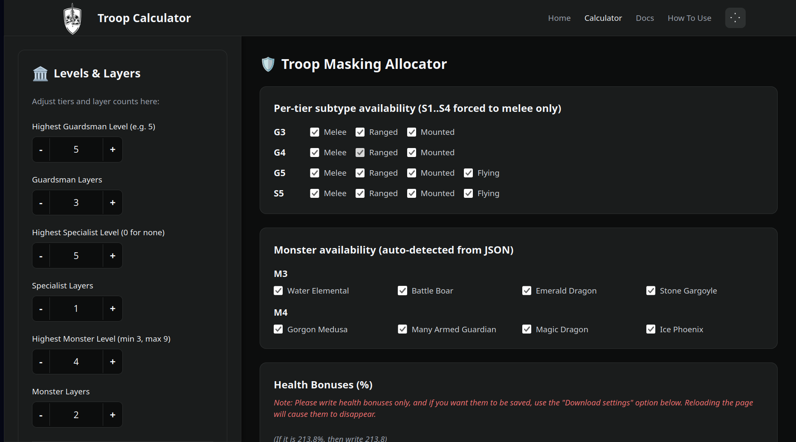

# Troop Optimizer

[](https://www.python.org/)
[](https://fastapi.tiangolo.com/)
[](https://react.dev/)
[](https://vitejs.dev/)
[](https://www.gnu.org/licenses/gpl-3.0)

---

## What It Does

**Troop Optimizer** is a strategic calculation tool designed to help you determine the most efficient troop composition for your military engagements. By analyzing your health bonuses and leadership capacity constraints, the application computes optimal unit distributions that maximize valor point generation while maintaining tactical superiority on the battlefield.

The system transforms complex mathematical relationships between troop statistics, health modifiers, and capacity limitations into actionable strategic insights, enabling commanders to make data-driven decisions about force composition without manual calculation overhead.



---

## Features

The application delivers real-time troop optimization through an intuitive web interface, processing your health bonuses and leadership constraints to generate optimal unit distributions instantly. Sophisticated algorithms automatically layer troops based on health thresholds and combat effectiveness, ensuring efficient deployment of higher-tier units while maintaining tactical superiority.

The system includes an import/export feature for saving custom configurations, seamless light/dark mode switching, and a step-based workflow that guides users through the optimization process while maintaining full transparency into calculations and allocation logic.

---

## Project Structure

```
troop-optimizer/
├── backend/
│   ├── main.py                # FastAPI entry point
│   ├── core/
│   │   ├── logic.py           # Core troop optimization logic
│   │   ├── utils.py           # Helper utilities
│   │   └── data_loader.py     # JSON reader for troop data
│   └── troops_data.json       # Base data file for troop stats
│
├── frontend/
│   ├── package.json
│   ├── vite.config.js
│   ├── src/
│   │   ├── App.jsx
│   │   ├── components/        # InputPanel, ResultsTable, SummaryPanel
│   │   └── api/api.js         # Axios API integration
│
└── README.md
```

---

## Built With

- **Python (FastAPI)** — High-performance asynchronous backend framework for rapid API development
- **React + Vite** — Modern frontend stack combining component-based architecture with lightning-fast build tooling
- **Axios** — Promise-based HTTP client for seamless backend communication
- **TailwindCSS** — Utility-first CSS framework enabling responsive and maintainable styling

---

## License

This project is licensed under the **GNU General Public License v3.0 (GPLv3)**.

You are free to use, modify, and distribute this software, provided that any derivative works remain open source under the same license terms. See the [LICENSE](LICENSE) file for complete details.