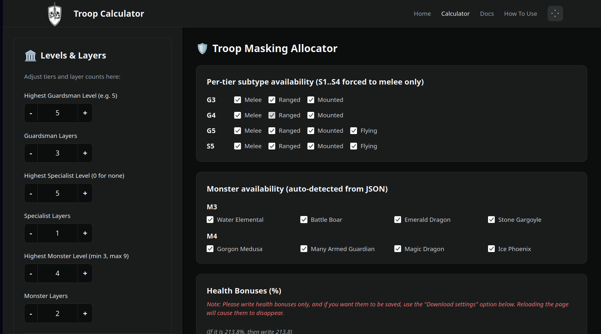

# Troop Optimizer For Total Battle
 **Live at :** [https://troop-stacking-allocator.onrender.com/](https://troop-stacking-allocator.onrender.com/)

[](https://www.python.org/)
[](https://fastapi.tiangolo.com/)
[](https://react.dev/)
[](https://vitejs.dev/)
[](https://www.gnu.org/licenses/gpl-3.0)

---

### What It Does

**Troop Optimizer** is a calculator for very precise death order. If you play the game, you know what it is. If you are new then you will know soon.


---

## For Devs

### Project Structure

```
troop-optimizer/
├── backend/
│   ├── main.py                # FastAPI entry point
│   ├── core/
│   │   ├── logic.py           # Core troop optimization logic
│   │   ├── utils.py           # Helper utilities
│   │   └── data_loader.py     # JSON reader for troop data
│   └── troops_data.json       # Base data file for troop stats
│
├── frontend/
│   ├── package.json
│   ├── vite.config.js
│   ├── src/
│   │   ├── App.jsx
│   │   ├── components/        # InputPanel, ResultsTable, SummaryPanel
│   │   └── api/api.js         # Axios API integration
│
└── README.md
```

---

### Built With

- **Python (FastAPI)** — High-performance asynchronous backend framework for rapid API development
- **React + Vite** — Modern frontend stack combining component-based architecture with lightning-fast build tooling
- **Axios** — Promise-based HTTP client for seamless backend communication
- **TailwindCSS** — Utility-first CSS framework enabling responsive and maintainable styling

---

### License

This project is licensed under the **GNU General Public License v3.0 (GPLv3)**.

You are free to use, modify, and distribute this software, provided that any derivative works remain open source under the same license terms. See the [LICENSE](LICENSE) file for complete details.
